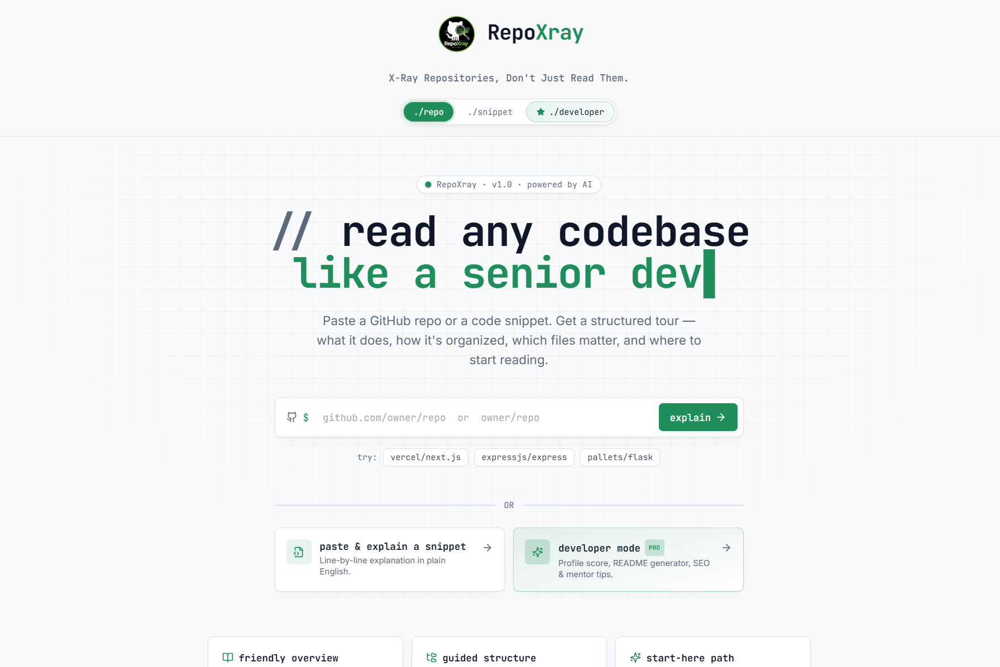
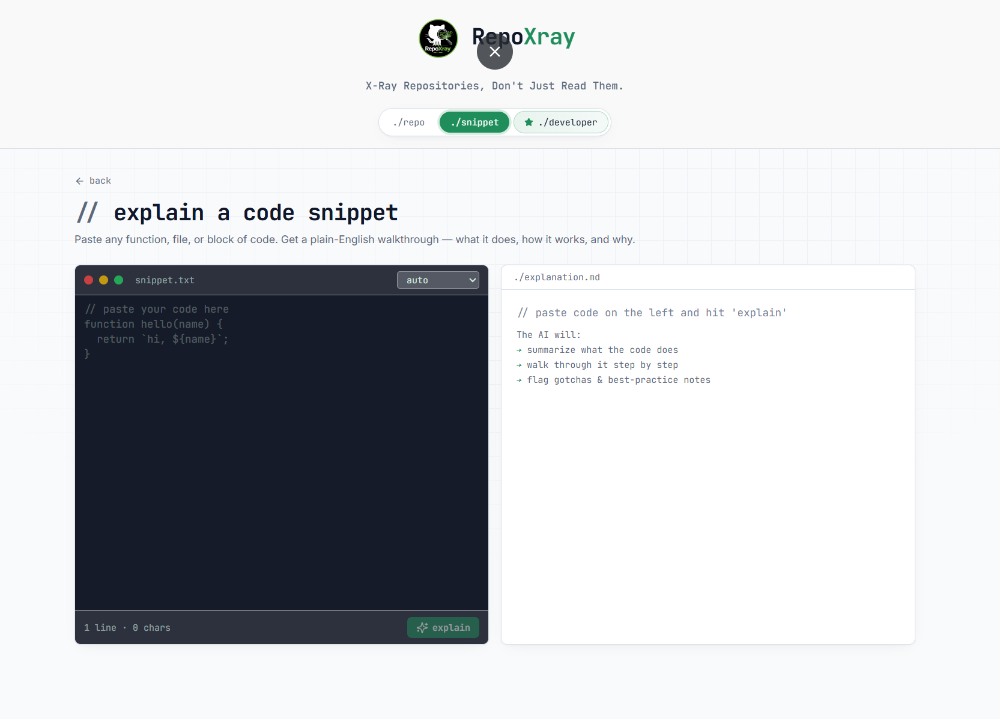
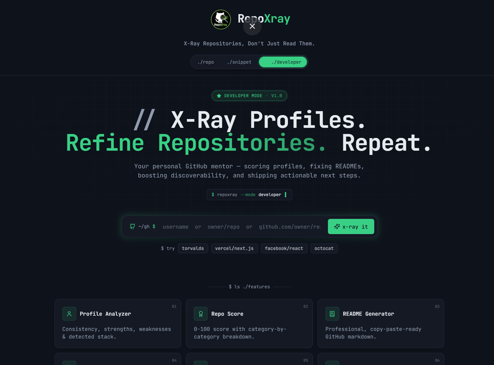

# 🔍 RepoXray

> **X-Ray Repositories, Don’t Just Read Them.**

---

## 🚀 Overview

**RepoXray** is an AI-powered developer tool that helps you **understand any GitHub repository like a senior developer**.

Paste a repo → get:

* 📘 Structured explanation
* 🌳 File-wise breakdown
* 🧠 Smart insights
* 🚀 Guided learning path

---

## 🖼️ Preview

### 🏠 Home



---

### 🧩 Snippet Mode



---

### 🧑‍💻 Developer Mode



---

## ⚡ Features

* 🔍 Repository Analysis
* 🌳 Guided Structure
* 📘 Friendly Overview
* 🚀 Start-Here Path
* 🧑‍💻 Developer Mode

  * Profile Analyzer
  * Repo Score
  * README Generator
  * SEO Optimizer
* 🛡️ DevSecOps Insights (Upcoming)

---

## 🏗️ Project Structure

```
RepoXray/
│
├── public/
├── src/
│   ├── assets/
│   ├── components/
│   ├── hooks/
│   ├── integrations/
│   ├── lib/
│   ├── pages/
│   ├── store/
│   ├── test/
│   ├── types/
│   ├── App.tsx
│   ├── main.tsx
│
├── supabase/
├── .env
├── package.json
└── vite.config.ts
```

---

## 🔄 How It Works

```
        ┌───────────────┐
        │  User Input   │
        │ (Repo URL)    │
        └──────┬────────┘
               ↓
        ┌───────────────┐
        │ Repo Fetching │
        └──────┬────────┘
               ↓
        ┌───────────────┐
        │ AI Processing │
        │ (LLM Engine)  │
        └──────┬────────┘
               ↓
        ┌───────────────┐
        │ Structured UI │
        │ Output Tabs   │
        └───────────────┘
```

---

## 🧭 Internal Flow

```
User → Input Repo
        ↓
GitHub API → Fetch Files
        ↓
Parser → Extract Structure
        ↓
LLM → Generate Insights
        ↓
Formatter → Clean Output
        ↓
Frontend → Display Tabs
```

---

## 🧩 UI Flow

```
[ Home ]
   ↓
[ Paste Repo URL ]
   ↓
[ Analysis Loading ]
   ↓
[ Output Dashboard ]
   ├── Overview
   ├── Structure
   ├── File Insights
   └── Start Here
```

---

## 🧑‍💻 Developer Mode

```
Developer Mode
   ├── Profile Analysis
   ├── Repo Score
   ├── README Generator
   ├── SEO Optimizer
   └── Suggestions Engine
```

---

## 🚀 Getting Started

```bash
git clone https://github.com/KrrishSR4/RepoXray.git
cd RepoXray
npm install
npm run dev
```

---

## 💡 Use Cases

* 🧑‍🎓 Students learning open-source
* 👨‍💻 Developers exploring repos
* 🏢 Teams reviewing projects
* 🚀 Beginners understanding codebases

---

## 🌟 Future Enhancements

* 🛡️ DevSecOps Security Scanner
* 📊 Repo Health Score
* 🔄 CI/CD Detection
* 🤖 AI Code Reviewer

---

## 🔥 RepoXray Philosophy

> “Don’t just read code. Understand it.”

---

## 📈 SEO Keywords

github repo analyzer
ai code explainer
understand codebase tool
developer productivity tool
github repository insights
learn coding faster
repo structure analyzer

---

## 🤝 Contributing

Pull requests are welcome.
Open an issue for suggestions or improvements.

---

## ⭐ Support

If you like this project, give it a ⭐ on GitHub!

---

## 🚀 RepoXray

> **X-Ray. Refine. Repeat.**
